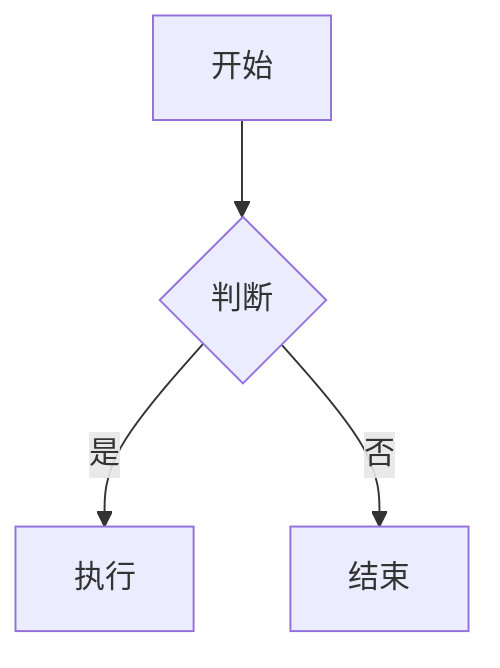

# 一级标题

## 二级标题

### 三级标题

#### 四级标题

##### 五级标题

###### 六级标题

这是一段正文段落，包含**加粗文字**、*斜体文字*、~~删除线~~、==高亮==、`行内代码`和[链接](https://example.com)。行内公式如 $E = mc^2$、$a^2 + b^2 = c^2$、$\frac{-b \pm \sqrt{b^2 - 4ac}}{2a}$ 可以自然嵌入段落中流动排版。

> 这是一段引用块内容，可以跨越多行。引用块通常用于展示引文、补充说明或强调内容。

> 这是另一种引用风格。

```python
def hello():
    print("Hello, WeWrite!")

# 多行代码示例
for i in range(10):
    hello()

class Calculator:
    def __init__(self):
        self.result = 0

    def add(self, x: int, y: int) -> int:
        return x + y

    def multiply(self, x: int, y: int) -> int:
        return x * y

    def divide(self, x: int, y: int) -> float:
        if y == 0:
            raise ValueError("Cannot divide by zero")
        return x / y
```

```typescript
interface User {
  id: string;
  name: string;
  email: string;
  role: 'admin' | 'editor' | 'viewer';
}

async function fetchUser(id: string): Promise<User> {
  const response = await fetch(`/api/users/${id}`);
  if (!response.ok) {
    throw new Error(`Failed to fetch user: ${response.statusText}`);
  }
  return response.json();
}

const user = await fetchUser('usr_12345');
console.log(user.name);
```

```css
.container {
  display: flex;
  flex-direction: column;
  gap: 1rem;
  max-width: 680px;
  margin: 0 auto;
  padding: 2rem 1rem;
}

.card {
  background: var(--bg-card);
  border-radius: 8px;
  box-shadow: 0 2px 8px rgba(0, 0, 0, 0.1);
  padding: 1.5rem;
  transition: transform 0.2s ease;
}

.card:hover {
  transform: translateY(-2px);
}
```

```sql
SELECT
  u.name,
  u.email,
  COUNT(o.id) AS order_count,
  SUM(o.total_amount) AS total_spent
FROM users u
LEFT JOIN orders o ON u.id = o.user_id
WHERE u.created_at >= '2024-01-01'
  AND u.status = 'active'
GROUP BY u.id, u.name, u.email
HAVING COUNT(o.id) > 0
ORDER BY total_spent DESC
LIMIT 20;
```

| 序号 | 特性 | 说明 | 示例 | 备注 |
|------|------|------|------|------|
| 1 | 加粗 | 强调文字 | **重要** | 语义化强调 |
| 2 | 斜体 | 次要强调 | *注释* | 用于术语或书名 |
| 3 | 删除线 | 标记删除 | ~~废弃~~ | 表示移除或过时 |
| 4 | 高亮 | 标记重点 | ==重点== | 视觉突出显示 |
| 5 | 行内代码 | 代码片段 | `print()` | 等宽字体渲染 |
| 6 | 链接 | 超链接 | [示例](https://example.com) | 外部资源引用 |
| 7 | 脚注 | 页面脚注 | 文字[^1] | 补充说明信息 |
| 8 | 上标 | 指数表示 | x^2^ | 数学幂运算 |
| 9 | 下标 | 化学式 | H~2~O | 分子式表示 |
| 10 | 表情 | 表情符号 | :smile: | 情感与语气表达 |

[^1]: 这是脚注内容的详细说明，会在页面底部显示。

> [!note] 这是笔记提示框
> 用于记录需要留意的备注信息，内容较为随意。

> [!abstract] 这是摘要提示框
> 用于概括文档或章节的核心内容要点，帮助读者快速了解主旨。

> [!info] 这是信息提示框
> 用于展示补充信息或背景知识，帮助读者理解上下文。

> [!tip] 这是技巧提示框
> 提供实用的建议或快捷操作，帮助提高效率或改善体验。

> [!success] 这是成功提示框
> 用于展示已完成的操作、达成的目标或正面的结果反馈。

> [!question] 这是问题提示框
> 用于提出疑问、引发思考或向读者收集反馈意见。

> [!warning] 这是警告提示框
> 提醒注意事项、潜在风险或需要谨慎处理的敏感操作。

> [!failure] 这是失败提示框
> 用于报告操作失败、错误状态或未能达成预期目标的情况。

> [!danger] 这是危险提示框
> 警示严重风险、不可逆操作或需要立即关注并处理的紧急问题。

> [!bug] 这是Bug提示框
> 用于记录已知问题、软件缺陷或尚未修复的错误。

> [!example] 这是示例提示框
> 提供具体的使用示例、场景演示或代码范例供参考。

> [!quote] 这是引用提示框
> 用于展示引文、名言或他人观点，具有区别于正文的视觉样式。

- 无序列表项一
- 无序列表项二
  - 嵌套列表项
  - 另一个嵌套项
- 无序列表项三

1. 有序列表项一
2. 有序列表项二
   3. 嵌套有序项
   4. 另一个嵌套项
5. 有序列表项三

- [ ] 待完成的任务
- [x] 已完成的任务
- [ ] 另一个待办事项

---




$$

\begin{aligned}
\nabla \times \vec{\mathbf{B}} - \frac{1}{c} \frac{\partial \vec{\mathbf{E}}}{\partial t} &= \frac{4\pi}{c} \vec{\mathbf{j}} \\
\nabla \cdot \vec{\mathbf{E}} &= 4\pi\rho \\
\nabla \times \vec{\mathbf{E}} + \frac{1}{c} \frac{\partial \vec{\mathbf{B}}}{\partial t} &= \vec{\mathbf{0}} \\
\nabla \cdot \vec{\mathbf{B}} &= 0
\end{aligned}

$$

$$

f(x) = \frac{1}{\sigma \sqrt{2\pi}} e^{-\frac{(x-\mu)^2}{2\sigma^2}}

$$

$$

\sum_{n=1}^{\infty} \frac{1}{n^2} = \frac{\pi^2}{6}

$$
